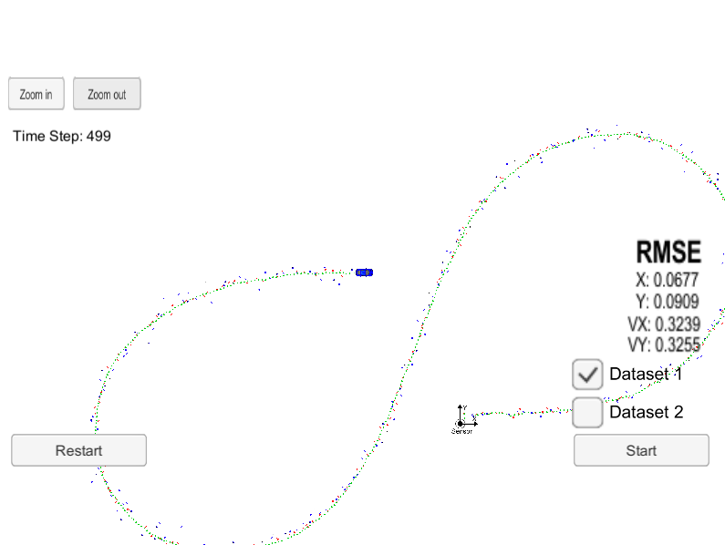

# Unscented Kalman Filter Project

## Algorithm
This project is based on constant turn rate and velocity
magnitude model (CTRV).

Unscented Kalman Filter algorithm includes the following step:
- Generate sigma points.
- Argument sigma points with `std_a` and `std_yawdd`.
- Predict sigma points of `x` at `(k+1)`.
- Calculate mean and covariance.
- Update measurement according to rader or lidar data.

Refer course video/assignments for algorithm details.

## Result

The final tracking result and RMSE is showed in Figure 1.

  
   
  <em>Figure 1: Final Result</em>

## Reference
- [Eigen Quick Reference Guide](https://eigen.tuxfamily.org/dox/group__QuickRefPage.html)
- [Eigen Documentation of Cholesky Decomposition](https://eigen.tuxfamily.org/dox/classEigen_1_1LLT.html)

